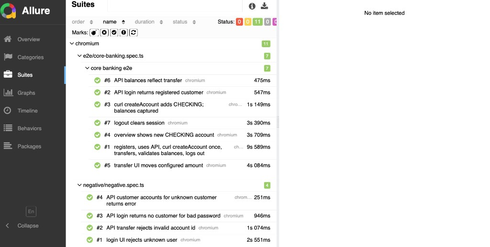

# ParaBank Playwright framework (TypeScript)

End-to-end and API checks against the public [ParaBank](https://parabank.parasoft.com/parabank) demo. Submission format: **GitHub repository** (replace the placeholder remote in your fork).

## Setup

- Node.js LTS
- Playwright as a testing framework (latest version) with TypeScript
- From the repo root: install dependencies with npm ci (or npm install), then install browsers with npx playwright install --with-deps chromium

## Run

- npm test — headless Chromium
- npm run test:headed — local debugging with a visible browser
- npm run test:ui — Playwright UI mode
- npm run report — open the last Playwright HTML report
- npm run allure:generate — build Allure HTML from `./allure-results` into `./allure-report`
- npm run allure:open — open the generated Allure report (run generate first)

## Reports

Playwright’s HTML report is opened with `npm run report`. For Allure, each run writes raw results under `./allure-results` (see `playwright.config.ts`); CI uploads that folder as the `allure-results` artifact so you can download it and run `npm run allure:generate` locally, then `npm run allure:open`.

Allure **Suites** view (example full run: **10 passed** tests — six under `e2e/core-banking.spec.ts`, four under `negative/negative.spec.ts`, Chromium):

## Environment

- BASE_URL — application root, default ends with a slash so relative routes resolve under /parabank/ (for example the public demo plus parabank path and trailing slash)
- API_BASE_URL — REST root ending at /services/bank

## Tests

The project defines **10 tests** in total: **6** in `tests/e2e/core-banking.spec.ts` (one serial top-level `describe` plus nested `describe` blocks for grouped hooks) and **4** in `tests/negative/negative.spec.ts`. A full `npm test` run executes all ten on the configured projects (Chromium only by default).

Specs live under `tests/`. Shared Playwright wiring (API client, page objects, optional **registeredUser**) comes from `tests/fixtures/bankFixture.ts`.

### End-to-end (`tests/e2e/core-banking.spec.ts`)

High-level story: **one new customer** (created by the worker `registeredUser` fixture: register on the site, then log out so the next steps start “clean”) goes through a **linear banking journey** split into **serial** tests so each step stays small and readable.

1. **API login** — Confirms the REST login matches the registered user (customer id, first name).
2. **curl createAccount** — Lists accounts, picks a funding account, calls **POST createAccount** via **curl** only (CHECKING), then snapshots **pre-transfer balances** from the API for later math checks.
3. **Overview (UI)** — `test.beforeEach` in a nested `describe` performs UI login (each test still gets a **new** context, so login cannot be skipped). Then opens the overview and checks the **new account id** appears.
4. **Transfer (UI)** — Same nested `beforeEach` logs in again, then runs a **UI transfer** from the funding account to the new account for a fixed amount.
5. **Balances (API)** — Re-reads both accounts and asserts balances moved by that amount versus the snapshot from step 2. **No** UI `beforeEach` (API-only).
6. **Logout (UI)** — A separate nested `describe` uses its own `beforeEach` login, then **logout** and asserts the session is cleared.

Order matters: later tests reuse **ids and balances** produced earlier in the same `describe`. Serial order does not reuse cookies; `beforeEach` only centralizes the repeated login steps for UI tests and is **not** placed on the outer `describe` so API-only tests are not forced through the browser.

### Negatives (`tests/negative/negative.spec.ts`)

Separate, mostly **independent** checks that the app and API **reject bad input** without depending on registration:

- **UI:** login with a **non-existent user** and expect an error message (native form submit path used on purpose for this case).
- **API:** transfer with an **invalid from-account id** (400 + error text).
- **API:** login with the **seeded demo username** and a **wrong password** (no customer, error body).
- **API:** customer accounts for an **unknown customer id** (error / empty list).

These do **not** use `registeredUser`, so they stay cheap and safe to run in parallel with other work when worker count allows.

### Per test: behavior and preconditions

**Global (all tests):** Playwright can reach `BASE_URL` / `API_BASE_URL` (defaults: public ParaBank). Chromium project from `playwright.config.ts`.

**Core banking** (`core banking e2e` describe is **serial**; earlier tests must pass or later ones see wrong or zero state.)

| Test | What it does | Preconditions |
|------|----------------|---------------|
| **API login returns registered customer** | Calls `bankApi.login` with fixture credentials; asserts HTTP 200, non-null customer, positive `customerId`, first name matches registration. Stores `customerId`. | **`registeredUser` fixture** finished successfully in this worker (UI registration + logout on live app). First test in the chain that requests this fixture. |
| **curl createAccount adds CHECKING; balances captured** | Loads accounts for `customerId`, picks a funding account (prefers CHECKING with highest balance), **POST createAccount** via **curl**, asserts new CHECKING account and ids. Reads both accounts via API and stores **pre-transfer balances** and account ids. | **Previous test passed** (`customerId` valid). **curl** on PATH. API allows createAccount for that customer. |
| **overview shows new CHECKING account** | Nested `beforeEach` runs UI login (fetch-based path); test opens overview, asserts **new account id** is visible. | **Previous tests passed** (`newAccountId` set). Same `registeredUser` credentials still valid. |
| **transfer UI moves configured amount** | Same nested `beforeEach` login; test opens transfer page, submits **from** funding account **to** new account for `ParabankTestConstants.e2eTransferAmount` (`5.00`), asserts success UI. | **Previous tests passed** (`fundAccountId`, `newAccountId`). Funding account has enough balance for the transfer. |
| **API balances reflect transfer** | `getAccountById` for both accounts; asserts balances equal **pre-transfer ± transfer amount** (two decimals). | **Transfer test passed** (balances changed as expected). Snapshot fields from curl test still valid. |
| **logout clears session** | Nested `beforeEach` UI login; test calls logout, asserts logged-out UI. | **`registeredUser`** credentials valid; app logout flow available. |

**Negatives** (order-independent; no `registeredUser`.)

| Test | What it does | Preconditions |
|------|----------------|---------------|
| **login UI rejects unknown user** | Submits login form with a **unique fake username** and wrong password; expects login **error** UI (browser submit path). | Login page reachable; demo shows an error for unknown users. |
| **API transfer rejects invalid account id** | `transferFunds(0, seededDemoAccountId, '1.00')`; expects **400** and body containing `Could not find account`. | Public DB still has account **12567** for demo user `john` (see `ParabankTestConstants`). |
| **API login returns no customer for bad password** | `login('john', 'notdemo')`; expects **400**, null customer, body indicating invalid credentials. | Seeded user **`john`** exists with password **`demo`** on the instance (wrong password must not authenticate). |
| **API customer accounts for unknown customer returns error** | `getCustomerAccounts(999999999)`; expects **400** and empty accounts list. | API returns 400 for non-existent customer id on this build. |

## Design decisions

- Page objects isolate UI selectors (register, login, overview, transfer, logout) from assertions in specs.
- BankApi wraps Playwright’s request fixture for JSON calls (login, accounts, transfer, balances) so tests stay readable and typed.
- **Registration fixture:** a worker-scoped `registeredUser` fixture (in `tests/fixtures/bankFixture.ts`) registers once per worker, asserts success, logs out, and exposes `username` / `password` / `firstName`. Specs that do not depend on it never hit registration.
- **Core banking E2E:** one serial `describe` with focused tests (API login → curl createAccount → UI overview → UI transfer → API balance checks → logout). Shared numeric state is carried via `let` bindings in the describe block. UI login is shared via **`test.beforeEach` on nested `describe` blocks** so API-only steps are not preceded by a browser login; each test still uses a **new** context, so `beforeEach` re-logs in where needed.
- **curl:** generic `execCurlSync` in `src/infra/cmdCommands.ts` runs `curl` via `execFileSync` with no shell, captures status and body. Only **POST createAccount** (new CHECKING) uses it, wired through `CurlCreateAccountClient` / `createCheckingAccountViaCurl`. ParaBank expects **newAccountType as integer 0** for CHECKING (string CHECKING returns 404 on this service build).
- Primary UI login after registration uses an in-page fetch POST to login.htm with credentials included so the JSESSIONID matches what the UI would set; native form submit against the hosted demo was returning a generic error page under automation while the same credentials worked via API and fetch.

## Tradeoffs

- Public shared SUT: data and availability vary; tests use unique short usernames and random address or phone fields to reduce collisions.
- Reporters: Playwright HTML, list, and **allure-playwright** (results under `allure-results`); traces on first retry.
- CI uses a single worker to reduce load on the demo and avoid parallel registrations colliding.

## Assumptions

- curl is available on PATH in CI and locally (standard on GitHub-hosted runners and macOS).
- Chromium-only scope is enough for the assignment; other browsers can be added as extra projects.
- John demo user and account ids used in API-only negatives match the seeded database on the public instance.

## How to scale

- Split specs by domain (registration, transfers, API contracts) and tag them for selective runs.
- Shard in CI with multiple jobs and disjoint test data factories.
- Introduce environment-specific projects in playwright.config for staging versus production-like URLs.
- Grow BankApi with shared response DTOs and optional Zod validation if the suite expands.

## Docker

- Build the image from the Dockerfile in this repo; it extends the official Playwright image, copies the project, runs npm ci, and defaults to npx playwright test with CI set. Mount volumes or pass env vars at run time for different targets.

---

## Infrastructure considerations (prose only)

### Project architecture

Layer UI flows in page objects, keep REST access in a small API client that accepts Playwright’s APIRequestContext, and keep shell-free curl behind `cmdCommands` / the narrow create-account wrapper so “curl only for createAccount” stays obvious in review. Types for Customer and Account live beside the client. The long banking journey is a serial chain of small tests plus a worker-scoped registration fixture, which limits interference on a shared demo; negatives stay in separate specs and remain parallel where the config allows.

### Configuration management

Defaults point at the public ParaBank URLs; overrides use BASE_URL and API_BASE_URL so a fork can aim at another environment without code edits. Keeping the application base URL with a trailing slash matters because Playwright merges relative navigations against that base. Secrets are not required for this public app; a real bank would inject credentials via GitHub Actions secrets and short-lived tokens, never committed files.

### Reporting and debugging

HTML reports and list output give quick CI signal; traces on first retry capture network and DOM when a step flakes. Failures on the hosted demo are often environmental, so artifacts should be retained long enough to compare API responses with UI screenshots. Local reproduction uses headed or UI mode and the same env vars as CI.

### CI implementation

GitHub Actions checks out the repo, installs Node, runs npm ci, installs Chromium with system deps, runs the suite with CI true and a single worker, then uploads **playwright-report** and **allure-results** as artifacts. Branch filters use main or master; extend as needed. Adding Slack or PR comments would plug in after the test step based on pass or fail.

### Dockerization

The provided Dockerfile packages the same install and test path as CI inside the Playwright base image so runs are reproducible on a laptop without local browser installs. For larger pipelines, the same image can be referenced from a matrix job or from Kubernetes Task runners; production promotion would still gate on green tests and promoted configuration, not on the image alone.
